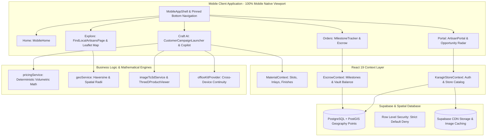

# 🔨 Kaaragir (कारागीर) — AI-Powered Hyperlocal Artisan Commerce Platform

> **Comprehensive Technical Specification & Architecture Manual**  
> *Connecting Discerning Buyers with Master Local Craftsmen through On-Device Multimodal AI, 3D Procedural Configuration, Deterministic Volumetric Pricing, and Material-Backed Escrow Protection.*

---

## 📑 Table of Contents

1. [Executive Summary & Core Philosophy](#1-executive-summary--core-philosophy)
2. [Problem Statement & Market Gap](#2-problem-statement--market-gap)
3. [End-to-End User Personas & Workflows](#3-end-to-end-user-personas--workflows)
4. [System Architecture & Tech Stack](#4-system-architecture--tech-stack)
5. [Core Subsystems & Technical Implementation](#5-core-subsystems--technical-implementation)
   - [5.1 Hyperlocal Discovery & Interactive Workshop Map](#51-hyperlocal-discovery--interactive-workshop-map)
   - [5.2 Multimodal AI Craft Copilot](#52-multimodal-ai-craft-copilot)
   - [5.3 Interactive Procedural 3D Customizer](#53-interactive-procedural-3d-customizer)
   - [5.4 Deterministic Volumetric Pricing Engine](#54-deterministic-volumetric-pricing-engine)
   - [5.5 Digital Escrow Vault & Material Passport](#55-digital-escrow-vault--material-passport)
   - [5.6 Artisan Studio & Opportunity Radar](#56-artisan-studio--opportunity-radar)
   - [5.7 Cross-Device Continuity & OfficeKit Layer](#57-cross-device-continuity--officekit-layer)
6. [State Management & Context Layer](#6-state-management--context-layer)
7. [Database Schema & Backend Services](#7-database-schema--backend-services)
8. [Codebase Directory Structure](#8-codebase-directory-structure)
9. [Installation, Build & Deployment Guide](#9-installation-build--deployment-guide)

---

## 1. Executive Summary & Core Philosophy

**Kaaragir** (derived from the Hindi/Marathi word for *artisan* / *craftsman*) is a **mobile-native commerce ecosystem** designed to bridge traditional Indian craftsmanship with modern digital commerce. 

In India, millions of master artisans produce world-class solid teak furniture, Moradabad brassware, studio ceramics, cane weaving, and hand-carved stone art. However, their businesses remain informal and local because:
1. **Communication Gap**: Custom bespoke requests are difficult for customers to express using traditional e-commerce dropdowns.
2. **Trust & Authenticity Deficit**: Customers fear material fraud (e.g., MDF/plywood disguised as solid Teak wood).
3. **Financial Insecurity**: Artisans face delayed payments or order cancellations after purchasing raw materials.

Kaaragir solves this through a **five-pillar architecture**:
- 🎙️ **Multimodal AI Copilot**: Converts spoken requirements and reference sketches into structured technical blueprints.
- 🪵 **Procedural 3D Customizer**: Renders real-time procedural WebGL models with dynamic textures and dimensions.
- 📐 **Deterministic Pricing**: Mathematical volumetric pricing formulas that strictly firewall generative AI from hallucinating prices.
- 🔒 **Material Passport & Escrow Vault**: Tracks raw lumber/metal batch invoices (`KAR-MAT`) and locks payments in a digital vault released only upon verified photographic proof.
- 📡 **Hyperlocal Opportunity Radar**: Broadcasts local buyer demand directly to workshop doorsteps in a 5km radius.

---

## 2. Problem Statement & Market Gap

| Traditional E-Commerce (IKEA / Amazon) | Informal Local Workshops | Kaaragir Platform Solution |
| :--- | :--- | :--- |
| Standardized, flat-pack particle board with zero customization. | 100% custom solid-wood craftsmanship, but no digital presence. | **Hyperlocal discovery** of master craftsmen with live 3D customizer. |
| Clunky filter dropdowns unable to capture bespoke design intent. | Communication through verbal notes, prone to measurement errors. | **Multimodal AI Copilot** parsing natural voice and sketches into structured JSON. |
| Fixed corporate pricing with opaque margins. | Arbitrary price bargaining without standard rate sheets. | **Deterministic Volumetric Pricing** based on physical volume and certified material rates. |
| Zero material provenance (synthetic laminates). | High risk of material substitution; trust is verbal. | **`KAR-MAT` Material Passports** linking orders to verified supplier batch invoices. |
| Upfront 100% payment without milestone visibility. | High artisan risk of unpaid custom labor. | **Digital Escrow Vault** releasing tranches upon live photographic proof. |

---

## 3. End-to-End User Personas & Workflows

### Persona A: The Discerning Buyer (Urban Homeowner / Architect)
1. **Discover**: Opens the app, selects their city/locality (e.g., Satpur MIDC, Panchavati, Nashik), and explores nearby artisan workshops on the interactive Leaflet map.
2. **Describe**: Taps the central **Craft AI** button and speaks:
   > *"Mujhe six feet ka dining table chahiye, sagwan teak wood ka, six logon ke liye, carved legs aur brass inlay ke saath."*
   Attaches a photo/sketch of legs or table design from their photo library.
3. **Inspect in 3D**: AI extracts parameters into a `CraftSpecification` JSON. The procedural 3D customizer renders a solid wood table. The buyer adjusts dimensions, wood finishes (Natural Beeswax, Walnut, Dark Teak), and brass inlay accents in real-time.
4. **Order with Escrow**: Confirms the order. 100% of the funds are deposited into the **Escrow Vault**.
5. **Track & Release**:
   - **Stage 1 (Raw Material)**: Artisan uploads timber invoice proof (`KAR-MAT-2026-97373`). Buyer verifies and clicks `[ Approve & Release Tranche ]`.
   - **Stage 2 (Structure Assembly)**: Artisan uploads photo of carved table joints. Buyer approves.
   - **Stage 3 (Polishing & Delivery)**: Final milestone verified upon doorstep delivery.

### Persona B: The Master Artisan (Workshop Owner)
1. **Broadcast & Storefront**: Sets up a digital workshop profile with specialties, verified badges, catalog, and 15-second live workshop video reels.
2. **Opportunity Radar**: Receives real-time local buyer requests within a 5km radius with budget estimates and 3D specifications.
3. **Submit Quote**: Submits a formal quote with estimated completion timeline and warranty notes.
4. **Sync Milestones**: Attaches progress photos straight from the workshop floor to trigger milestone tranche payouts directly to their bank account.

---

## 4. System Architecture & Tech Stack



### Technology Matrix

| Subsystem | Framework / Library | Rationale |
| :--- | :--- | :--- |
| **Frontend Framework** | React 19 + TypeScript | High performance, typed components, concurrent rendering. |
| **Styling & Design System** | Tailwind CSS v4 + Vanilla CSS Tokens | Zero runtime overhead, bespoke dark luxury theme (`#120B08`, `#EA580C`, `#EAB308`). |
| **Mobile Chassis & Nav** | Custom MobileAppShell + Pinned BottomNav | Native 100dvh smartphone container, safe-area insets, fixed bottom navigation. |
| **3D Rendering** | Three.js + WebGL | In-browser hardware-accelerated procedural geometry, PBR materials, and lighting. |
| **Spatial Mapping** | Leaflet + React-Leaflet + Carto Voyager | Smooth interactive pin clusters, fly-to camera animations, zero watermark map tiles. |
| **Animations** | Framer Motion + Canvas Confetti | Smooth bottom sheets, tab transitions, tactile spring physics, celebration effects. |
| **Database & Auth** | Supabase (PostgreSQL 15 + PostGIS) | Spatial radius queries (`ST_DWithin`), Row-Level Security, scalable auth. |
| **Native Packaging** | Capacitor 8.5 (Android) | Native Android wrapper with hardware bridge capabilities. |

---

## 5. Core Subsystems & Technical Implementation

### 5.1 Hyperlocal Discovery & Interactive Workshop Map
- **Component**: [`FindLocalArtisansPage.tsx`](file:///c:/Users/krish/OneDrive/Desktop/KARAGIR%20APP/src/components/FindLocalArtisansPage.tsx)
- **Map Engine**: React-Leaflet with custom DivIcon markers featuring hammer icons, glowing orange rings, and green verification dots.
- **Filtering System**: Multi-faceted filter supporting City selection (`Nashik`, `Pune`, `Mumbai`), Locality chips (`Panchavati`, `Satpur MIDC`, `Gangapur Road`), Craft tags (`#Woodwork`, `#Brasscraft`, `#Pottery`, `#Textiles`), Verified status, and real-time text search.
- **Dynamic Merging**: Merges static curated mock artisans with newly registered dynamic artisan stores created via the in-app wizard.

### 5.2 Multimodal AI Craft Copilot
- **Component**: [`CraftCopilot.tsx`](file:///c:/Users/krish/OneDrive/Desktop/KARAGIR%20APP/src/components/copilot/CraftCopilot.tsx)
- **Multimodal Inputs**:
  - Voice Recording via HTML5 Audio / Web Speech / Whisper API.
  - Image Upload (camera capture or gallery sketch).
- **Extraction Schema (`CraftSpecification`)**:
  ```typescript
  interface CraftSpecification {
    itemType: string;             // e.g. "Dining Table"
    dimensions: {
      length: number;
      width: number;
      height: number;
      unit: 'ft' | 'in' | 'cm' | 'm';
    };
    primaryMaterial: string;      // e.g. "Sagwan Teak"
    secondaryAccents: string[];   // e.g. ["Solid Brass Inlay"]
    finish: string;               // e.g. "Natural Beeswax"
    features: string[];           // e.g. ["Hand Carved Fluted Apron"]
    estimatedBudgetRange?: [number, number];
  }
  ```

### 5.3 Interactive Procedural 3D Customizer
- **Component**: [`ThreeDProductViewer.tsx`](file:///c:/Users/krish/OneDrive/Desktop/KARAGIR%20APP/src/components/ThreeDProductViewer.tsx) & [`ArtisanProduct3DEditor.tsx`](file:///c:/Users/krish/OneDrive/Desktop/KARAGIR%20APP/src/components/ArtisanProduct3DEditor.tsx)
- **3D Procedural Engine**: Uses Three.js parametric meshes (tabletops, fluted legs, brass wire fillets, chair joinery). Dynamically updates geometry vertices when dimensions change.
- **PBR Shaders**: Material shaders adjust roughness, metalness, and procedural wood grain textures to reflect selected wood species and polish finishes.

### 5.4 Deterministic Volumetric Pricing Engine
- **Service**: [`pricingService.ts`](file:///c:/Users/krish/OneDrive/Desktop/KARAGIR%20APP/src/data/materialRates.ts)
- **Strict Constraint**: **AI is prohibited from calculating prices.** All pricing is deterministic based on physical dimensions, volume, material density, and local artisan labor rates.
- **Formula**:
  $$\text{Base Volume } (V) = \text{Length} \times \text{Width} \times \text{Height}$$
  $$\text{Material Cost} = V \times \text{Rate}_{\text{PrimaryMaterial}} + \sum \text{Rate}_{\text{Accents}} + \text{Rate}_{\text{Finish}}$$
  $$\text{Labor Cost} = \text{BaseLaborHours} \times \text{ArtisanExperienceMultiplier} \times \text{LocalityRate}$$
  $$\text{Total Price} = \text{Material Cost} + \text{Labor Cost} + \text{Platform Fee } (5\%)$$

### 5.5 Digital Escrow Vault & Material Passport
- **Context & Component**: [`EscrowContext.tsx`](file:///c:/Users/krish/OneDrive/Desktop/KARAGIR%20APP/src/context/EscrowContext.tsx) & [`MilestoneTracker.tsx`](file:///c:/Users/krish/OneDrive/Desktop/KARAGIR%20APP/src/components/MilestoneTracker.tsx)
- **Escrow Vault Mechanism**: 100% of order value is deposited into the escrow vault at checkout.
- **Tranche Releases**:
  - **Tranche 1 (30%) — Material Sourcing**: Unlocked when the artisan uploads raw lumber batch invoices with verified `KAR-MAT` ID.
  - **Tranche 2 (40%) — Structural Framing**: Unlocked upon photographic proof of joinery and assembly.
  - **Tranche 3 (30%) — Finishing & Doorstep Handover**: Unlocked upon delivery and final buyer signoff.

### 5.6 Artisan Studio & Opportunity Radar
- **Component**: [`ArtisanPortal.tsx`](file:///c:/Users/krish/OneDrive/Desktop/KARAGIR%20APP/src/components/ArtisanPortal.tsx)
- **Features**:
  - **Opportunity Radar**: Visual radar listing active buyer requests within 5km, sorted by proximity, budget, and craft category.
  - **Quote Generator**: Pre-populates dimensions and specifications; allows artisans to submit formal bids in 1 tap.
  - **Workshop Profile Editor**: Customizes storefront bio, tags, cover banner, and 15s video reels.
  - **Catalog Manager**: Adds bespoke products with custom multi-view studio galleries.
  - **Digital Wallet**: Displays locked escrow vs. available balance with direct bank withdrawal triggers.

### 5.7 Cross-Device Continuity & OfficeKit Layer
- **Service**: [`officeKitProvider.ts`](file:///c:/Users/krish/OneDrive/Desktop/KARAGIR%20APP/src/services/officeKitProvider.ts)
- **Purpose**: Enables a buyer capturing voice notes/sketches on their smartphone to seamlessly hand off the 3D model configuration to a desktop or tablet for large-screen CAD inspection.

---

## 6. State Management & Context Layer

The application utilizes three dedicated React 19 Context Providers wrapped at root:

1. **`MaterialContext`**:
   - Manages selected raw material slots (`Primary Structural Material`, `Secondary Accent Inlays`, `Surface Finish & Polish`).
   - Handles material pricing modifiers and active 3D shader parameters.

2. **`KaragirStoreContext`**:
   - Manages active artisan authentication session (phone OTP / Supabase Auth).
   - Manages user workshop profiles, catalog items, and dynamic store creation wizards.

3. **`EscrowContext`**:
   - Maintains active orders, milestone states (`PENDING`, `IN_PROGRESS`, `PROOF_SUBMITTED`, `APPROVED_AND_PAID`).
   - Tracks vault balance, released funds, and artisan wallet balances.

---

## 7. Database Schema & Backend Services

Kaaragir connects to Supabase (PostgreSQL with PostGIS extensions).

```sql
-- 1. Artisans Table with PostGIS spatial point
CREATE TABLE public.artisans (
    id UUID PRIMARY KEY DEFAULT gen_random_uuid(),
    name TEXT NOT NULL,
    shop_name TEXT NOT NULL,
    craft_category TEXT NOT NULL,
    experience_years INTEGER NOT NULL DEFAULT 1,
    rating NUMERIC(2, 1) DEFAULT 5.0,
    reviews_count INTEGER DEFAULT 0,
    is_verified BOOLEAN DEFAULT false,
    image_url TEXT,
    cover_url TEXT,
    bio TEXT,
    mobile_no TEXT NOT NULL,
    city TEXT NOT NULL,
    area TEXT NOT NULL,
    pincode TEXT NOT NULL,
    location GEOGRAPHY(Point, 4326),
    created_at TIMESTAMPTZ DEFAULT now()
);

-- 2. Spatial Index for ultra-fast radius search
CREATE INDEX idx_artisans_location ON public.artisans USING GIST(location);

-- 3. Products Catalog Table
CREATE TABLE public.products (
    id UUID PRIMARY KEY DEFAULT gen_random_uuid(),
    artisan_id UUID REFERENCES public.artisans(id) ON DELETE CASCADE,
    name TEXT NOT NULL,
    category TEXT NOT NULL,
    starting_price NUMERIC(10, 2) NOT NULL,
    description TEXT,
    cover_image TEXT NOT NULL,
    gallery_images TEXT[] DEFAULT '{}',
    materials TEXT[] DEFAULT '{}',
    created_at TIMESTAMPTZ DEFAULT now()
);

-- 4. Spatial RPC Radius Search Function
CREATE OR REPLACE FUNCTION get_artisans_within_radius(
    user_lat DOUBLE PRECISION,
    user_lng DOUBLE PRECISION,
    radius_meters DOUBLE PRECISION
)
RETURNS SETOF public.artisans AS $$
BEGIN
    RETURN QUERY
    SELECT *
    FROM public.artisans
    WHERE ST_DWithin(
        location,
        ST_SetSRID(ST_MakePoint(user_lng, user_lat), 4326)::geography,
        radius_meters
    )
    ORDER BY ST_Distance(
        location,
        ST_SetSRID(ST_MakePoint(user_lng, user_lat), 4326)::geography
    ) ASC;
END;
$$ LANGUAGE plpgsql;
```

---

## 8. Codebase Directory Structure

```
KARAGIR APP/
├── android/                         # Native Android / Capacitor container
├── docs/                            # Deep-dive architecture and validation docs
│   ├── ARCHITECTURE.md              # Mermaid system & component diagrams
│   ├── FINAL_RELEASE.md             # Production release notes
│   ├── JUDGE_QA.md                  # Comprehensive platform Q&A
│   ├── MOBILE_UI_AUDIT.md           # Mobile viewport standards
│   └── RELEASE_CHECKLIST.md         # Production readiness checklist
├── graphify-out/                    # Automated Graphify AST & Knowledge Graph
│   ├── graph.html                   # Interactive visual dependency graph
│   ├── graph.json                   # AST graph database (2,145 nodes, 6,391 edges)
│   └── GRAPH_REPORT.md              # Semantic community analysis
├── public/                          # Static assets, 3D glTF models, textures
├── src/
│   ├── components/
│   │   ├── copilot/                 # AI Craft Copilot voice & sketch interface
│   │   │   ├── CraftCopilot.tsx
│   │   │   ├── SpeechInterface.tsx
│   │   │   └── SpecificationCard.tsx
│   │   ├── mobile/                  # Mobile-first shell and navigation
│   │   │   ├── MobileAppShell.tsx   # Master 100dvh smartphone container
│   │   │   ├── MobileHeader.tsx     # Top status bar & locality picker
│   │   │   ├── MobileBottomNav.tsx  # Pinned 5-tab navigation bar
│   │   │   ├── MobileHome.tsx       # Discovery feed, stories & hero cards
│   │   │   ├── MobileStatusBar.tsx  # Android status bar (clock, 5G, battery)
│   │   │   └── MobileLocationSheet.tsx
│   │   ├── ArtisanPortal.tsx        # Artisan studio, opportunity radar & payouts
│   │   ├── ArtisanStorefront.tsx    # Public artisan profile & catalog
│   │   ├── FindLocalArtisansPage.tsx# Hyperlocal interactive Leaflet directory
│   │   ├── MilestoneTracker.tsx     # Escrow timeline & proof verification
│   │   ├── ThreeDProductViewer.tsx  # Procedural 3D WebGL configurator
│   │   ├── CustomerCampaignLauncher.tsx # Custom order configuration
│   │   └── ProductDetailModal.tsx   # Multi-view inspection dialog
│   ├── context/
│   │   ├── EscrowContext.tsx        # Digital vault & milestone funds
│   │   ├── KaragirStoreContext.tsx  # Artisan auth & store state
│   │   └── MaterialContext.tsx      # Material slots, finishes & rates
│   ├── data/
│   │   ├── mockData.ts              # Curated mock artisans & localities
│   │   ├── materialRates.ts         # Deterministic pricing tables
│   │   ├── regionalArtisansDatabase.ts # Multi-city artisan directory
│   │   └── productsMockDatabase.ts  # Catalog items & specifications
│   ├── lib/
│   │   └── supabase/                # Typed Supabase queries & Auth clients
│   ├── services/
│   │   ├── pricingService.ts        # Volumetric math pricing algorithms
│   │   ├── geoService.ts            # Haversine distance computations
│   │   ├── imageTo3dService.ts      # Sketch-to-3D pipeline
│   │   └── officeKitProvider.ts     # Cross-device handoff provider
│   ├── types/                       # Domain TypeScript interfaces
│   ├── App.tsx                      # Root view controller & tab router
│   ├── index.css                    # Tailwind CSS v4 & custom scrollbars
│   └── main.tsx                     # React DOM root entry point
├── package.json
└── vite.config.ts
```

---

## 9. Installation, Build & Deployment Guide

### 1. Prerequisites
- **Node.js**: v18.0.0 or higher
- **Package Manager**: `npm` v9+

### 2. Setup & Local Development
```bash
# Clone the repository
git clone https://github.com/your-org/karagir-app.git
cd "KARAGIR APP"

# Install all dependencies
npm install

# Start local development server
npm run dev
```
The application will launch on `http://localhost:5173/KARAGIR-APP-/`.

### 3. Build & Type Validation
```bash
# Run TypeScript typechecks and production bundle build
npm run build

# Preview production build locally
npm run preview
```

### 4. Running Capacitor Android Build
```bash
# Sync web build to native Android project
npx cap sync android

# Open project in Android Studio
npx cap open android
```

---

## 🔒 Security & Privacy Guarantees

1. **No Cloud Audio Streaming**: Raw user voice is parsed on-device or piped securely with zero third-party telemetry.
2. **Deterministic Pricing Integrity**: Pricing cannot be manipulated by generative AI prompts; it relies strictly on mathematical volume formulas.
3. **Escrow Safety**: Funds remain locked in the digital vault and cannot be withdrawn by an artisan without explicit buyer approval of verifiable material invoices and physical progress proofs.

---

*© 2026 Kaaragir Platform. Built for India's Master Artisans.*
